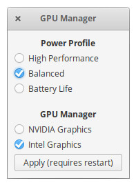

# Elementary GPU Manager

Utility for managing graphics and power profiles in ElementaryOS.

## Description

Graphical user interface to easily switch between Intel/Nvidia GPU.

It is intended to install [system76-power](https://support.system76.com/articles/graphics-switch-ubuntu/) from [System76](https://system76.com/) by adding the [PPA](https://launchpad.net/~system76-dev/+archive/ubuntu/stable). The software is an alternative solution for laptops with a hybrid graphics card using ElementaryOS. Other Ubuntu-based distributions have not been tested.



## Instalation

1. First, make sure your system is up to date.
1. [Download this repository](https://github.com/filipestevao/elementary-gpu-manager/archive/master.zip).
1. Run `install.sh`:

```
sh ./install.sh
```
This should install `system76-power` and the graphical interface.

## Notes

### Graphics card information

To view the graphics card information:

```
glxinfo | grep OpenGL
```

### Testing FPS

To test the FPS (*Nvidia's FPS should be higher*):

```
__GL_SYNC_TO_VBLANK=0 glxgears
```

### Kernel updates

After each kernel update, the following command will be required:

```
sudo dpkg --configure -a
```

To be sure that you must run this command, just run `sudo apt update && sudo apt upgrade` and a warning should appear.